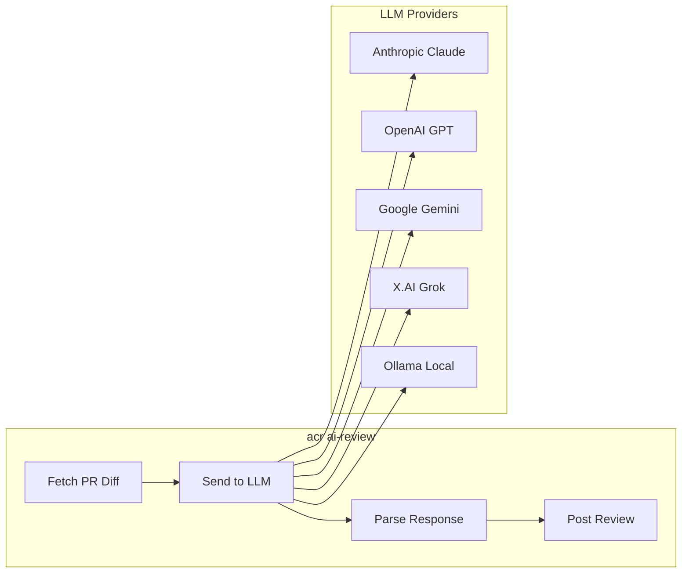

# AI Review

The `ai-review` command generates AI-powered code reviews using large language models.

## Overview



## Quick Start

```bash
# Set API key
export ANTHROPIC_API_KEY=sk-ant-...

# Review a PR
acr ai-review 123 -o owner -r repo
```

## Command Reference

```bash
acr ai-review <pr-number> [flags]
```

### Flags

| Flag | Short | Env Var | Default | Description |
|------|-------|---------|---------|-------------|
| `--model` | | `OMNILLM_MODEL` | `claude-sonnet-4` | LLM model to use |
| `--scope` | | `ACR_REVIEW_SCOPE` | `full` | Review focus area |
| `--event` | `-e` | `ACR_REVIEW_EVENT` | (from AI) | Override review verdict |
| `--dry-run` | | | `false` | Print without posting |
| `--max-tokens` | | | `4096` | Maximum response tokens |
| `--owner` | `-o` | `GITHUB_OWNER` | | Repository owner |
| `--repo` | `-r` | `GITHUB_REPO` | | Repository name |

### Examples

```bash
# Basic review with Claude Sonnet
acr ai-review 123 -o myorg -r myrepo

# Security-focused review with GPT-4
acr ai-review 123 -o myorg -r myrepo --model gpt-4o --scope security

# Preview review without posting
acr ai-review 123 -o myorg -r myrepo --dry-run

# Force COMMENT verdict (never auto-approve)
acr ai-review 123 -o myorg -r myrepo --event COMMENT

# Use environment variables
export GITHUB_OWNER=myorg
export GITHUB_REPO=myrepo
export OMNILLM_MODEL=gemini-1.5-pro
acr ai-review 123
```

## Review Scopes

### Full (default)

Comprehensive review covering all aspects:

- **Correctness** — Logic errors, edge cases, boundary conditions
- **Security** — Injections, auth issues, data exposure
- **Performance** — N+1 queries, inefficient algorithms
- **Maintainability** — Readability, complexity, structure
- **Testing** — Coverage, edge cases, test quality

### Security

Focused security audit:

- Injection vulnerabilities (SQL, XSS, command)
- Authentication & authorization flaws
- Hardcoded secrets and credentials
- Input validation issues
- Vulnerable dependencies

### Style

Code quality and best practices:

- Naming conventions
- Readability and documentation
- Code structure and organization
- Consistency with project patterns
- Language idioms and anti-patterns

### Performance

Performance analysis:

- Database query optimization
- Algorithm complexity
- Memory management
- I/O efficiency
- Concurrency issues

## Supported Models

### Anthropic (Claude)

| Model | Description |
|-------|-------------|
| `claude-sonnet-4` | Balanced speed/quality (recommended) |
| `claude-opus-4` | Highest quality, slower |
| `claude-haiku-3.5` | Fastest, lower cost |

```bash
export ANTHROPIC_API_KEY=sk-ant-...
acr ai-review 123 -o owner -r repo --model claude-sonnet-4
```

### OpenAI (GPT)

| Model | Description |
|-------|-------------|
| `gpt-4o` | Latest GPT-4, multimodal |
| `gpt-4-turbo` | GPT-4 Turbo |
| `gpt-3.5-turbo` | Faster, lower cost |

```bash
export OPENAI_API_KEY=sk-...
acr ai-review 123 -o owner -r repo --model gpt-4o
```

### Google (Gemini)

| Model | Description |
|-------|-------------|
| `gemini-1.5-pro` | Best quality |
| `gemini-1.5-flash` | Faster |

```bash
export GEMINI_API_KEY=...
acr ai-review 123 -o owner -r repo --model gemini-1.5-pro
```

### X.AI (Grok)

| Model | Description |
|-------|-------------|
| `grok-2` | Latest Grok model |

```bash
export XAI_API_KEY=...
acr ai-review 123 -o owner -r repo --model grok-2
```

### Ollama (Local)

Run models locally without API keys:

```bash
# Start Ollama server
ollama serve

# Pull a model
ollama pull llama3

# Run review
acr ai-review 123 -o owner -r repo --model llama3
```

Set custom Ollama URL:

```bash
export OLLAMA_BASE_URL=http://localhost:11434
```

## GitHub Actions Integration

Use AI reviews in your CI/CD pipeline with manual trigger for cost control.

### Setup

1. Copy the workflow to your repository:

```bash
mkdir -p .github/workflows
curl -o .github/workflows/ai-review.yml \
  https://raw.githubusercontent.com/plexusone/agent-code-review/main/examples/github-actions/ai-review.yml
```

2. Add secrets to your repository:
   - Go to **Settings → Secrets and variables → Actions**
   - Add `ANTHROPIC_API_KEY` (or other provider keys)

3. Run the workflow:
   - Go to **Actions → AI Code Review**
   - Click **Run workflow**
   - Enter PR number and options
   - Click **Run workflow**

### Workflow Configuration

```yaml
name: AI Code Review

on:
  workflow_dispatch:
    inputs:
      pr_number:
        description: 'Pull Request number to review'
        required: true
        type: number
      model:
        description: 'LLM model to use'
        default: 'claude-sonnet-4'
        type: choice
        options:
          - claude-sonnet-4
          - gpt-4o
          - gemini-1.5-pro
      scope:
        description: 'Review focus'
        default: 'full'
        type: choice
        options:
          - full
          - security
          - style
          - performance
```

### Cost Control

The workflow uses `workflow_dispatch` (manual trigger) instead of automatic triggers to:

- **Control costs** — Only review PRs you choose
- **Avoid noise** — Don't auto-review draft PRs or WIP
- **Select scope** — Use cheaper models or focused scopes when appropriate

!!! tip "Cost Optimization Tips"
    - Use `claude-haiku-3.5` or `gpt-3.5-turbo` for quick checks
    - Use `--scope security` for security-focused reviews (smaller prompts)
    - Use `--dry-run` to preview before posting
    - Run locally with Ollama for free (but slower)

## Review Output Format

AI reviews follow a structured format:

```markdown
## Summary
[1-2 sentence overview]

## Findings

### Critical
[Must-fix issues]

### Suggestions
[Improvement recommendations]

### Positive
[Things done well]

## Verdict
[APPROVE | COMMENT | REQUEST_CHANGES]
[Brief justification]
```

The verdict determines the GitHub review event:

| Verdict | GitHub Event | Meaning |
|---------|--------------|---------|
| `APPROVE` | Approval | PR is ready to merge |
| `COMMENT` | Comment | Observations, no verdict |
| `REQUEST_CHANGES` | Changes requested | Issues must be addressed |

## Programmatic Usage

Use the `pkg/aireview` package in Go:

```go
package main

import (
    "context"
    "fmt"
    "log"

    "github.com/plexusone/agent-code-review/pkg/aireview"
)

func main() {
    ctx := context.Background()

    reviewer, err := aireview.NewReviewer(aireview.Config{
        Model:     "claude-sonnet-4",
        Scope:     aireview.ScopeSecurity,
        MaxTokens: 4096,
    })
    if err != nil {
        log.Fatal(err)
    }
    defer reviewer.Close()

    output, err := reviewer.Review(ctx, aireview.ReviewInput{
        Title: "Add authentication",
        Body:  "This PR adds JWT authentication",
        Diff:  `+func validateToken(token string) bool { ... }`,
    })
    if err != nil {
        log.Fatal(err)
    }

    fmt.Println(output.Content)
    fmt.Printf("Verdict: %s\n", output.Verdict)
    fmt.Printf("Tokens: %d\n", output.TokensUsed)
}
```
